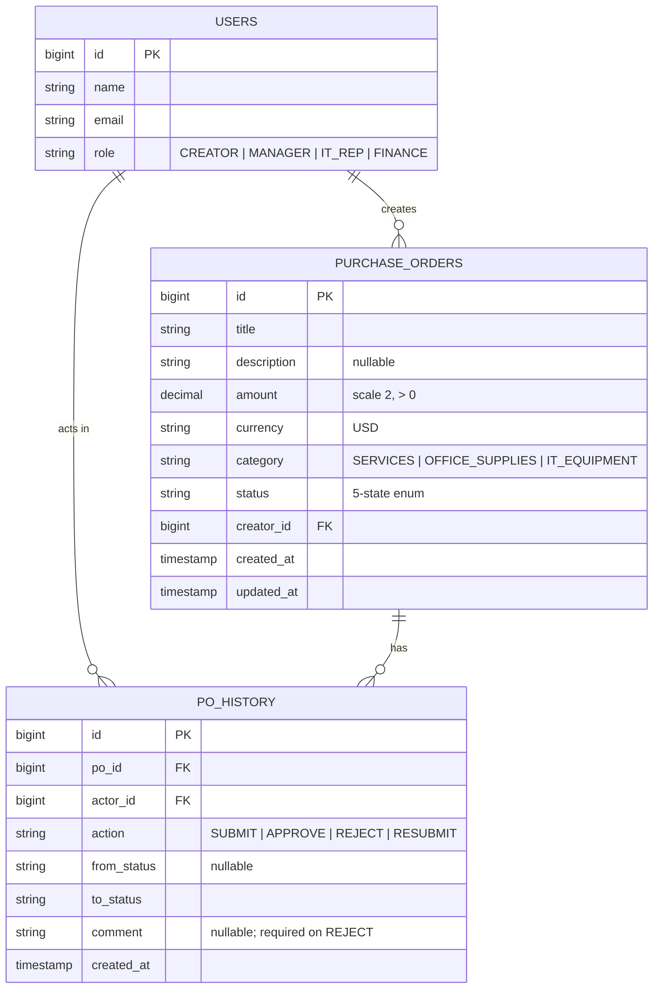
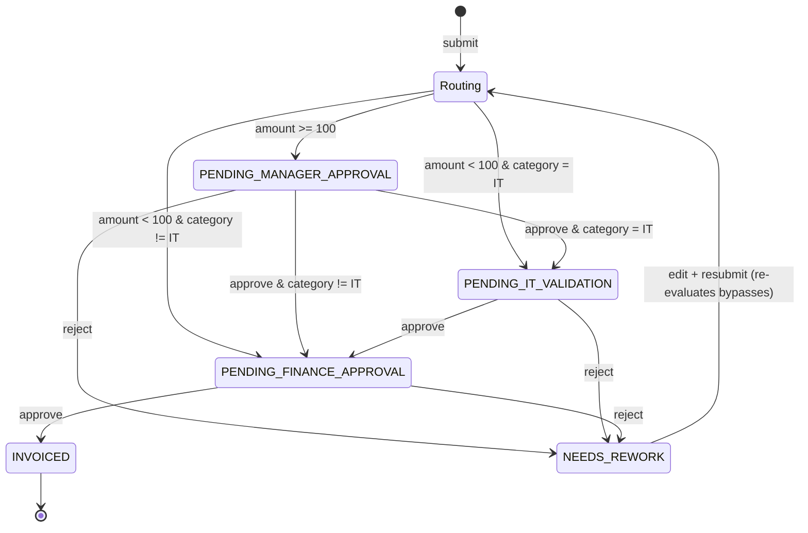

# Purchase Order (PO) Management System — Design Document

> Status: **Approved design, pre-implementation.** Source requirements: [`req.txt`](./req.txt).

## 1. Objective

A full-stack web application that automates the creation, approval, and invoicing of
Purchase Orders, replacing a manual, paper-based procurement process. The system enforces
a conditional approval workflow with a rejection/rework loop.

## 2. Glossary

| Term | Meaning |
|------|---------|
| **PO** | Purchase Order — the central entity moving through the workflow. |
| **Routing** | The pure function that decides the next state of a PO from its amount + category. |
| **Bypass / skip** | A conditional stage that does not apply to a given PO (manager skip when `amount < 100`, IT skip when category ≠ IT Equipment). |
| **Rework loop** | A rejected PO returns to its creator as `NEEDS_REWORK`; on resubmit the approval process restarts from the beginning. |
| **Reviewer** | A user whose role owns the PO's current pending state (manager / IT rep / finance). |

## 3. Technology Stack

| Layer | Choice |
|-------|--------|
| Backend | Spring Boot 3.3, Java 21, **Maven**, Spring Web, Spring Data JPA (Hibernate), Flyway, Jakarta Bean Validation, Lombok/MapStruct |
| Frontend | Next.js 15 (App Router), React, TypeScript, Tailwind + shadcn/ui, TanStack Query, React Hook Form + Zod |
| Database | PostgreSQL 16 (Docker Compose) |
| Auth | Minimal: seeded users, cookie-based HTTP session, no JWT |
| Tests | JUnit 5 + Testcontainers (Postgres) backend; light Vitest/RTL frontend |

## 4. Architecture

Monorepo:

```
proiectAndra/
├── backend/             # Spring Boot app (Maven)
├── frontend/            # Next.js app
├── docker-compose.yml   # Postgres (+ optionally backend/frontend)
└── docs/                # this design doc, ADRs, requirements
```

The frontend is a pure client of the backend REST API. The backend owns all business
rules; the frontend never computes state transitions — it only renders state and offers
the actions the server says are legal.

## 5. Domain Model

Three entities. Money is stored as `DECIMAL`, never floating point.



`PO_HISTORY` is **append-only** — it is the audit trail and powers the UI timeline.

## 6. State Machine

Five states. A PO is born already submitted (no `DRAFT`); rejection always loops to
`NEEDS_REWORK` (no terminal `REJECTED`).



**Finance approval is never bypassed.** Only Manager (amount-gated) and IT
(category-gated) stages are conditional.

## 7. Routing Function

A single pure function drives both initial submit and every resubmit. There is no
separate "restart" code path.

Stages, in fixed order:

| # | Stage | Pending state | Applies when |
|---|-------|---------------|--------------|
| 1 | Manager | `PENDING_MANAGER_APPROVAL` | `amount >= 100` |
| 2 | IT | `PENDING_IT_VALIDATION` | `category == IT_EQUIPMENT` |
| 3 | Finance | `PENDING_FINANCE_APPROVAL` | always |
| — | Done | `INVOICED` | no stages remain |

```
nextStateAfter(po, completedStage):
    for stage in STAGES after completedStage (in order):
        if stage.appliesTo(po):
            return stage.pendingState
    return INVOICED

submit/resubmit(po)  -> nextStateAfter(po, completedStage = NONE)
approve(po)          -> nextStateAfter(po, completedStage = stage owning po.status)
reject(po, comment)  -> NEEDS_REWORK   // comment required
```

Because routing reads the PO's **current** amount/category, editing those during rework
correctly re-gates the workflow (e.g. bumping $50 → $500 now requires manager approval).

### Bypass truth table (entry state on submit)

| amount | category | Manager? | IT? | Entry state |
|--------|----------|----------|-----|-------------|
| `< 100` | non-IT | skip | skip | `PENDING_FINANCE_APPROVAL` |
| `< 100` | IT | skip | yes | `PENDING_IT_VALIDATION` |
| `>= 100` | non-IT | yes | skip | `PENDING_MANAGER_APPROVAL` |
| `>= 100` | IT | yes | yes | `PENDING_MANAGER_APPROVAL` |

Boundary: **`< 100` is strict** — exactly `100.00` requires manager approval.

## 8. Workflow Service

Hand-rolled `PurchaseOrderWorkflowService` (no state-machine library — see ADR-0001).
Each method validates the actor before mutating, then writes a `po_history` row.

| Method | Allowed when | Actor check | Result |
|--------|-------------|-------------|--------|
| `submit(po, actor)` | on create | actor = creator | routing from start |
| `approve(po, actor)` | status is a `PENDING_*` | actor.role owns status **and** actor ≠ creator | routing advances |
| `reject(po, actor, comment)` | status is a `PENDING_*` | actor.role owns status **and** actor ≠ creator; comment non-empty | `NEEDS_REWORK` |
| `resubmit(po, actor)` | status = `NEEDS_REWORK` | actor = creator | routing from start |

**Guards / invariants:**
- A reviewer cannot act on a PO they created (no self-approval).
- A PO is immutable once submitted **except** in `NEEDS_REWORK`, where only the creator may edit it.
- Illegal transitions (e.g. approving an `INVOICED` PO) are rejected with `409 Conflict`.

## 9. API Contract

All endpoints under `/api`. Auth via session cookie. Errors use a consistent JSON shape
`{ "error": { "code", "message", "details?" } }` with appropriate HTTP status.

### Auth & users
| Method | Path | Notes |
|--------|------|-------|
| `POST` | `/api/auth/login` | body `{ userId }` (pick a seeded user); sets session cookie |
| `POST` | `/api/auth/logout` | clears session |
| `GET`  | `/api/auth/me` | current user, or 401 |
| `GET`  | `/api/users` | seeded users, for the login picker |

### Purchase Orders
| Method | Path | Notes |
|--------|------|-------|
| `POST`  | `/api/pos` | create = submit; body `{ title, description?, amount, category }` |
| `GET`   | `/api/pos` | list; filters `?queue=me` (awaiting my role), `?creator=me`, `?status=` |
| `GET`   | `/api/pos/{id}` | detail + full `history[]` |
| `PATCH` | `/api/pos/{id}` | edit; **only when `NEEDS_REWORK`, only by creator** |
| `POST`  | `/api/pos/{id}/approve` | reviewer advances PO |
| `POST`  | `/api/pos/{id}/reject` | body `{ comment }` (required) → `NEEDS_REWORK` |
| `POST`  | `/api/pos/{id}/resubmit` | creator re-enters routing after editing |

Action endpoints are explicit verbs (not a generic status PATCH) so the client can never
construct an illegal transition — see ADR-0002.

## 10. Validation & Business Rules

- `title` — required, non-blank.
- `description` — optional.
- `amount` — required, `> 0`, `DECIMAL(scale 2)`.
- `currency` — `USD` only (for now).
- `category` — required, one of `SERVICES`, `OFFICE_SUPPLIES`, `IT_EQUIPMENT`.
- Manager bypass — strict `amount < 100`.
- IT validation — only when `category == IT_EQUIPMENT`.
- Finance approval — always required.
- Reject — `comment` required and non-blank; approve comment optional.
- Edit — allowed only in `NEEDS_REWORK`, only by the creator.

## 11. Authentication & Roles

- Single `role` per user: `CREATOR`, `MANAGER`, `IT_REP`, `FINANCE`.
- **Any authenticated user can create** a PO; role only gates reviewing.
- Login = pick a seeded user → backend sets an HTTP-only session cookie → Next.js sends
  it on every API call. A "switch user" affordance makes demoing the full workflow easy.
- Seeded demo users (one per role), e.g. `alice` (CREATOR), `bob` (MANAGER),
  `carol` (IT_REP), `dave` (FINANCE).

See ADR-0003.

## 12. Frontend

Four page-types, role-aware, functional styling (status badges + timeline; not gold-plated):

1. **Login** — seeded-user picker / switch-user.
2. **Dashboard** — two sections: *Awaiting my action* (reviewer queue for my role's state)
   and *My purchase orders* (POs I created, with status).
3. **PO detail** — fields + status timeline (from `po_history`) + context-aware actions
   (Approve/Reject for the owning reviewer; Edit/Resubmit for the creator in `NEEDS_REWORK`).
4. **Create / Edit form** — one shared RHF + Zod form, reused for create and rework edits.

Server state via TanStack Query; the UI renders only the actions the API reports as legal.

## 13. Testing Strategy

Backend-heavy (the routing + guards are the crown jewels), frontend-light. See ADR-0004.

- **Routing unit tests** — every bypass combination + the `100.00` boundary.
- **Workflow service unit tests** — role guards, no-self-approval, reject-requires-comment,
  illegal transitions, resubmit re-routing.
- **Integration tests** (`@SpringBootTest`) — happy paths + the full reject → rework →
  resubmit loop, against **Testcontainers Postgres** (exercises Flyway too).
- **Frontend** — manual demo verification + optionally one Vitest/RTL smoke test on the
  create form's Zod validation.

## 14. Dev Setup

- `docker-compose up` brings up Postgres 16.
- Backend: `./mvnw spring-boot:run` — Flyway applies schema migrations and seeds demo users
  on startup.
- Frontend: `npm run dev` (Next.js dev server), pointed at the backend API base URL.
- Seed data: one user per role + a few example POs spanning each routing path.

## 15. Out of Scope / Future Extensions

Deliberately excluded to match the spec; noted as clean future work:

- **Line items** (multiple products per PO summing to a total) — current model is single
  amount + single category.
- **Multi-currency** — `currency` field exists but only `USD` is supported.
- **Real authentication** (passwords, JWT, OAuth, RBAC beyond single role).
- **Notifications** (email/in-app when a PO needs your action).
- **Analytics / reporting dashboards.**
- **Multi-role users** and configurable approval chains.
